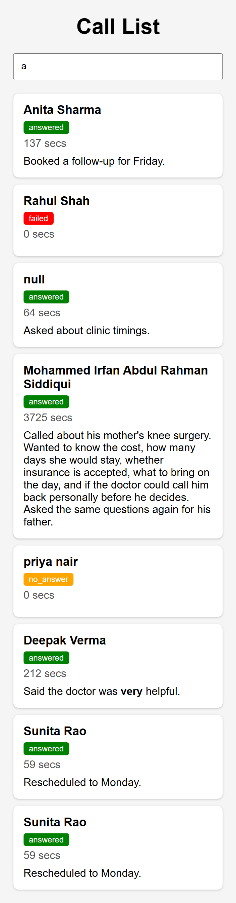
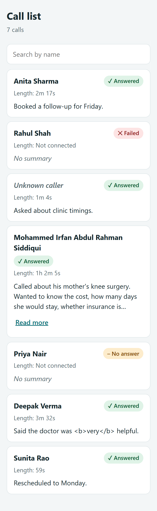
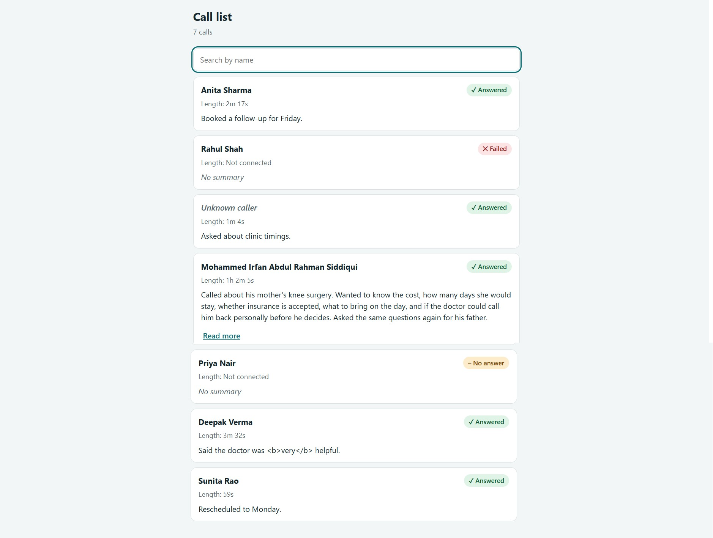
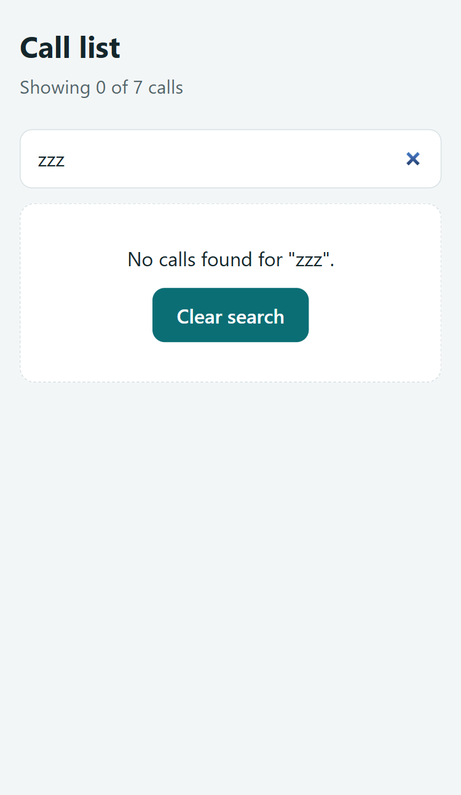
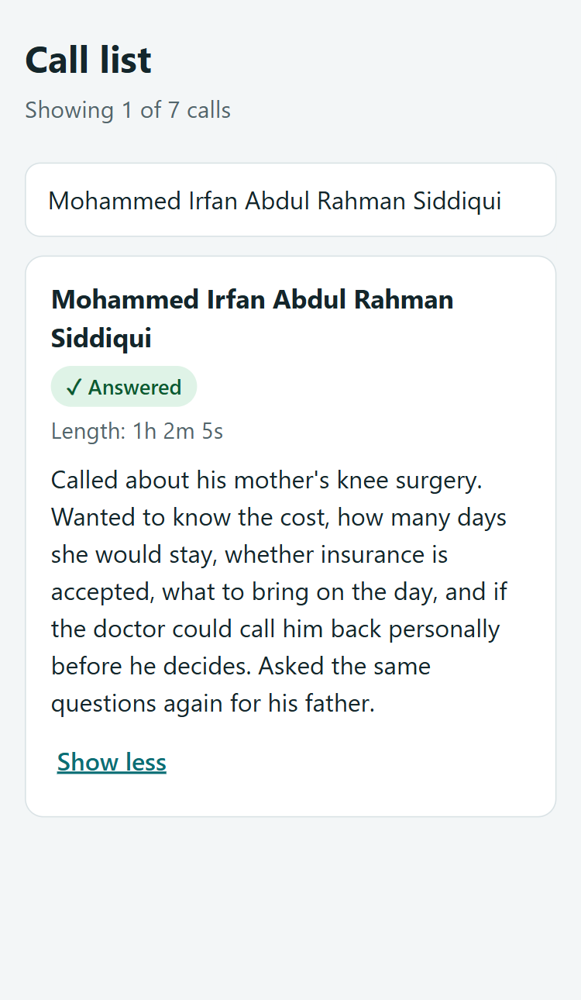
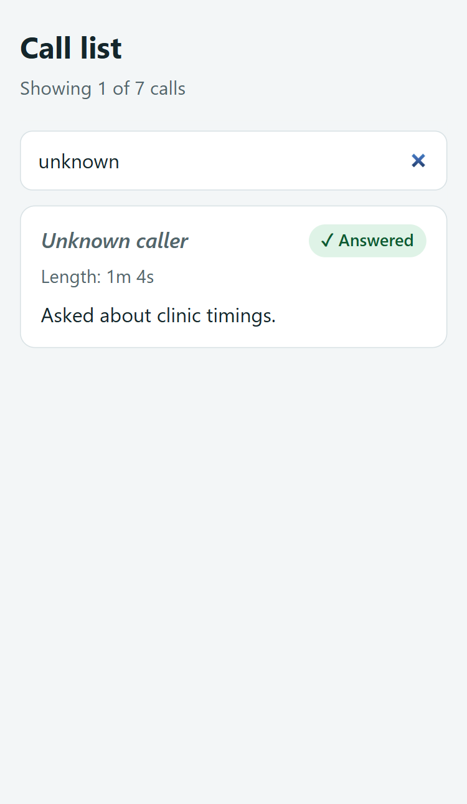

# Clinic Call List

A small, responsive web page that shows a clinic owner their recent calls: who called, what happened, how long it lasted, and a short summary. It includes a live search box that filters by name as you type.

Built for the **Logictap Frontend Task, Part 3: Build a small page with AI**.

| | Link |
|---|---|
| Repository | https://github.com/kishor7329/Logictap |
| Final version (live) | https://kishor7329.github.io/Logictap/index%20(1).html |
| Version 1 (live) | https://kishor7329.github.io/Logictap/v1.html |

> The task asks us to look at the **gap between Version 1 and the final**, so both files are kept in this repo, and Version 1 is left exactly as the AI produced it.

---

## 1. What the page does

- Shows each call's **name, status, length and summary** as a card.
- **Search box** filters the list by name as you type (case-insensitive, ignores extra spaces).
- Works on a **375px-wide phone screen** with no sideways scrolling.
- Handles messy real-world data safely (see section 4).
- Shows a clear **"No calls found"** message with a *Clear search* button when nothing matches.
- Shows a live count: "7 calls", or "Showing 1 of 7 calls" while searching.

## 2. Repository contents

| File / folder | Purpose |
|---|---|
| `v1.html` | **Version 1.** The first code the AI produced from a plain prompt. Untouched. |
| `index.html` | **Final version.** The improved page. (Currently uploaded as `index (1).html`; renaming it to `index.html` is recommended so GitHub Pages opens it at the root link.) |
| `screenshots/` | Version 1 and final screenshots (listed in section 7). |
| `README.md` | This document. |

## 3. How to run it

No server, build step or install is needed. The data is placed directly inside the code, exactly as the server sends it.

1. Download or clone the repo: `git clone https://github.com/kishor7329/Logictap.git`
2. Double-click `index.html` (or `v1.html`) to open it in any modern browser.
3. To check the phone layout: press `F12`, then `Ctrl+Shift+M`, and set the width to `375`.

**Tech:** plain HTML, CSS and JavaScript in a single file. No frameworks, no external libraries, no network requests, no tracking.

## 4. Problems in the data, and how the final version handles them

The sample data contains deliberate traps. Version 1 failed on every one of them.

| # | What the data contains | What Version 1 did | What the final version does |
|---|---|---|---|
| 1 | Call id 3 has `name: null` | Showed the word **"null"** as a person's name, and **search broke** (`null.toLowerCase()` threw an error, so the list silently stopped updating and showed wrong results) | Shows an italic **"Unknown caller"**. Search is safe with missing names, and typing "unknown" finds that call |
| 2 | Status is `no_answer`, `failed`, `answered` | Showed raw text like `no_answer`, relying on colour alone | Readable labels with a symbol: **✓ Answered**, **✕ Failed**, **– No answer**. Meaning never depends on colour alone |
| 3 | `duration_secs: 3725` | Showed "3725 secs" | Shows **"1h 2m 5s"**. 137 seconds shows as "2m 17s" |
| 4 | `duration_secs: 0` on failed and no-answer calls | Showed "0 secs", which sounds like a real call | Shows **"Not connected"** |
| 5 | Summary contains `<b>very</b>` | The browser **executed the HTML** and bolded the word. This means data was injected straight into the page, which is an XSS security risk | Summaries are inserted as **plain text** (`textContent`), so the tags display literally and nothing is executed |
| 6 | Id 7 (Sunita Rao) appears twice | Listed twice | **De-duplicated by `id`** (the first record is kept) |
| 7 | `"priya nair"` is all lowercase | Showed as typed | Shown as **"Priya Nair"**. Only all-lowercase names are changed, so names like "McDonald" are never damaged |
| 8 | Very long name and summary (id 4) | Long text made the card tall and hard to scan | Long words wrap safely, and the summary is collapsed to 3 lines with a **Read more / Show less** button |
| 9 | Empty summaries (ids 2 and 5) | Left a blank gap | Shows an italic **"No summary"** |
| 10 | Search returns nothing | Blank screen | Friendly empty state with a **Clear search** button |

## 5. Phone-first design decisions

Clinic owners are most likely to check this between patients, on a phone.

- **No horizontal scroll** at 375px. Long names wrap using `overflow-wrap: anywhere`.
- **Search input is 16px** so iPhones don't zoom the page when it is tapped.
- **Tap targets are 44px or taller** (search box, *Read more*, *Clear search*).
- The **search box stays at the top** (sticky) while scrolling a long list.
- On a laptop, content is centred in a **720px column** so lines don't stretch across a wide screen.
- Calm teal and slate palette, a system font stack (fast, no downloads), and clear spacing.

## 6. Accessibility

- The search box has a real (visually hidden) `<label>`, so screen readers announce it.
- The result count uses `aria-live="polite"`, so changes are announced as you type.
- *Read more* is a real `<button>` with `aria-expanded`, and is keyboard accessible.
- Visible keyboard focus outlines on every interactive element.
- Status badges combine **text + symbol + colour**.
- Text and badge colours were chosen for strong contrast against their backgrounds.

## 7. Screenshots

> Add these images to a `screenshots/` folder with the file names below, and they will display here.

### Version 1 (first AI output, untouched)

*Problems visible: "null" shown as a name, "no_answer" raw, "3725 secs", bold HTML from the summary, Sunita Rao twice, "priya nair" lowercase. Typing "a" did not filter the list because the null name broke search.*

### Final version

| Phone (375px) | Laptop (about 1440px) |
|---|---|
|  |  |

**Search for a name that is not in the list ("zzz"):**

**Extra evidence:**

| Long name, expanded summary | Searching "unknown" (null name handled) |
|---|---|
|  | |

## 8. Prompts used

**Prompt 1 (produced Version 1):**

> Build a call list page for a clinic owner using this data: [the JSON from the task]. Show each call's name, status, length and summary. Add a search box that filters by name as I type. Make it work on a phone. Single HTML file.

**Prompt 2 (produced the final version):**

> I tested your version 1 on a 375px screen. Problems: (1) search breaks when name is null, and the card shows "null"; (2) status shows raw `no_answer`; (3) 3725 secs should read "1h 2m 5s", and 0 secs for failed or no-answer calls shouldn't show "0 secs"; (4) the `<b>` in a summary is rendered as HTML, which is unsafe; (5) Sunita Rao appears twice (same id); (6) "priya nair" is not capitalized; (7) no empty state when search finds nothing. Fix all of these. Also: make the long summary collapsible, make status readable without relying on colour, use a 16px search input and 44px+ tap targets, and make sure nothing scrolls sideways at 375px. Keep it a single HTML file.

**Tool used:** Claude (chat). Chat link: *(https://claude.ai/chat/e17fc8f8-0b7e-48bc-aacf-0a2641408dc9)*

## 9. What changed between Version 1 and the final

Version 1 worked on the happy path but broke on the real data: a null name silently broke search and showed "null", raw statuses and "3725 secs" were unreadable, a summary's HTML was executed instead of shown as text, and Sunita Rao appeared twice. In the final version I handled each data case (unknown caller, readable status and duration, safe plain-text summaries, duplicates removed by id, tidy name capitalisation). I also made it work better on a phone: 16px search input, 44px tap targets, long text wrapping, a collapsible long summary, and a "no calls found" empty state.

**How I found the problems:** I opened Version 1 at 375px in Chrome DevTools, typed in the search box, and compared what I saw against the data. The AI did not flag any of these issues on its own. I listed them myself and sent them back in Prompt 2.

## 10. Decisions and trade-offs

- **De-duplicating by `id`**: the same id means the same call, so the first record is kept. If the server ever sends two *different* calls with one id, one would be hidden. In a real project I would ask the backend team to fix the duplicate at the source.
- **Capitalising only all-lowercase names**: it fixes "priya nair" without risking names that are intentionally mixed-case.
- **`textContent` instead of `innerHTML`**: it removes the whole class of HTML-injection problems, instead of trying to clean the text.
- **Search matches the displayed name**, so "unknown" finds the null-name call and "priya" matches "Priya Nair".
- **A single file with no libraries**: it is fast, easy to review, and easy to host anywhere.

## 11. Limitations and next steps

- The data is hard-coded, as the task allows. A real version would load it from the server and show loading and error states.
- Status filter chips (Answered / Failed / No answer) would help an owner who wants to see only the calls to follow up.
- Sorting by newest, and phone numbers or dates, would make the list more useful (neither is in the sample data).
- Add a small automated test for the helper functions (duration formatting, name formatting, de-duplication).
- A dark theme.

## 12. Manual test checklist

- [x] 375px width: no horizontal scroll
- [x] Type `a`: list filters correctly, with no errors in the console
- [x] Type `ANITA` (capitals): finds Anita Sharma
- [x] Type `unknown`: finds the null-name call
- [x] Type `zzz`: shows the empty state; *Clear search* resets the list
- [x] The `<b>very</b>` summary shows as literal text
- [x] Sunita Rao appears once
- [x] Mohammed's long summary expands and collapses
- [x] 3725s shows "1h 2m 5s"; 0s shows "Not connected"

## 13. Reflection (Part 4)

> Write these in your own words before submitting. They will be discussed on the 15-minute call.

1. **One thing an AI tool told me or wrote that was wrong, unnecessary or not useful, and what I did about it:** *(refreash the tab and again did the problem with other llm model  and compare with previous result. i saw some redundant images and unwanted information had provide us.)*
2. **Tools used:** *(e.g. Claude, Google Chrome and DevTools, GitHub, GitHub Pages, code editor)*
3. **Hardest part, in one line:** *(while building and testing the files and moreover trust on claude output which made more time consume)*
4. **Time taken:** *(upto 3 hours)*

---

*Built by Kishor for the Logictap Frontend Task Assignment.*
